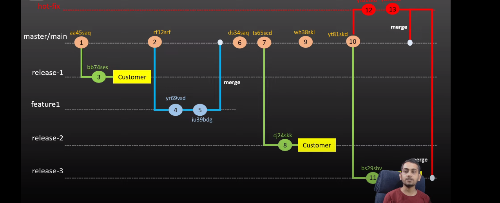

# WHAT IS .git DIR AND WHY USED IT ?

The `.git` directory is a hidden folder that Git creates at the root of every repository. It's like the brain of the repository, storing all the important information Git needs to manage the project. Here's a breakdown of what's inside:

1. **HEAD**: This file points to the current branch or commit you're working on.

2. **objects**: This folder holds all the commits, trees, and blobs that represent your files and their history. Git stores these objects in subfolders named with the first two characters of their SHA-1 hash values.

3. **refs**: This folder contains references to specific commits, like branch and tag pointers.

4. **config**: This file contains settings for your repository, like your username, default branch, and remote repository URLs.

5. **hooks**: This folder contains scripts that run automatically when certain Git events occur, like committing changes. You can use these scripts to enforce coding standards or run tests.

6. **index**: This file tracks changes to your working directory and prepares them for a commit. It lists filenames, status flags, and SHA-1 hashes for each tracked file.

7. **logs**: This folder keeps logs of all Git operations, like commits, merges, and branch updates.

8. **branches**: This file stores the SHA-1 hash value of the current branch head, which helps determine the next commit ID when you create a new commit.

9. **description**: This file provides a description of the repository, often used for web interfaces.

10. **info**: This folder holds global information files for the repository, which can configure Git's behavior or provide metadata.

11. **FETCH_HEAD**: This file stores SHA-1 hash values of fetched commits after a `git fetch` operation.

The `.git` directory is essential to how Git works, so it's crucial not to mess with it manually unless you really know what you're doing. Making changes to it could lead to data loss or corruption in your repository.

# WHAT IS TRACKED AND UNTRACKED FILE ?
What is Untracked File ?
An "untracked file" is a file in your Git repository that Git is not currently aware of or
tracking.
This means that Git is not monitoring the file for changes, and the file is not included in
Git's history or any commits.
When you create a new file in your Git repository, Git does not automatically start
tracking it.
If you accidentally delete a tracked file, you can restore it from the repository's history.
However, if you delete an untracked file, it will be lost forever.

What is tracked file ?
It is the apposite of the untracked file 

# STAGED VS UNSTAGED AREA ?
The staging area, also known as the index, is a crucial concept in Git. It acts as a middle ground between your working directory and the repository. 

Here's how it works:

1. **Working Directory**: This is where you make changes to your files. When you modify a file, Git recognizes it as "modified" in your working directory.

2. **Staging Area**: Before committing changes to the repository, you can choose which modifications you want to include in the next commit. By staging specific files or changes, you're preparing them to be committed. Think of the staging area as a snapshot of what your next commit will look like.

3. **Unstaged Area**: Any modifications that haven't been staged yet are considered to be in the unstaged area. These changes are still in your working directory but haven't been marked for the next commit.

So, the main difference between the staging area and the unstaged area is that the staging area contains changes that you've selected to be included in the next commit, while the unstaged area contains changes that you haven't yet prepared to be committed.

To summarize:

- **Staging Area**: Contains changes that are ready to be committed.
- **Unstaged Area**: Contains changes that haven't yet been prepared to be committed.

# What is Snapshot?
A "snapshot" refers to a specific point in time in the history of a Git repository.
When you create a commit in Git, you are essentially taking a snapshot of the current
state of the repository at that moment.
A snapshot captures all the changes you've made to the files in your repository up to
that point, along with information about who made the changes and when they were
made.
Each commit in a Git repository is a unique snapshot that represents a specific version
of the project.

# what is commit ?
In Git, a commit is a fundamental operation that records changes to the files in your project's repository. When you make changes to your project, such as modifying, adding, or deleting files, you use Git to commit those changes to the repository.

A commit consists of the following components:

1. **Changes**: The modifications you've made to the files in your project since the last commit. These changes can include edits to existing files, the addition of new files, or the deletion of existing files.

2. **Commit Message**: A descriptive message that summarizes the purpose of the commit. It explains why the changes were made and provides context for anyone reviewing the commit history.

3. **Author Information**: The name and email address of the person who made the commit. This information is recorded along with the commit to attribute it to the correct author.

4. **Timestamp**: The date and time when the commit was made. This helps to track the chronological order of commits within the repository's history.

When you commit changes in Git, you create a new point in the project's history. Each commit represents a snapshot of the project's state at that particular moment in time. This allows you to track the evolution of your project, review changes, and collaborate with others effectively.

Committing changes regularly and writing informative commit messages is essential for maintaining a clean and understandable project history. It helps you and your collaborators understand why changes were made, facilitates debugging, and enables efficient collaboration.

# what is HEAD ?
Sure, let's simplify it:

In Git, think of `HEAD` as a pointer or marker that shows you which version of your project you're looking at right now.

- **Current Version**: `HEAD` points to the latest version of your project. Whatever changes you see in your files, `HEAD` is showing you those changes.

- **Branches**: If you're working on a specific feature or task (let's say it's a branch called "feature"), `HEAD` points to the latest version of that branch. So, whatever you've done in the "feature" branch, `HEAD` is showing you that work.

- **Detached HEAD**: Sometimes, instead of pointing to a branch, `HEAD` directly points to a specific version of your project (a commit). This is like saying, "I'm not working on any specific task, just looking at this exact version." It's called "detached" because it's not attached to any branch.

- **Moving `HEAD`**: You can change what `HEAD` is pointing to. You can switch to a different branch, go back to a previous version, or even point to a completely different commit.

So, in simple terms, `HEAD` tells you which version of your project you're looking at right now, whether it's the latest work on a branch or a specific older version.

# Branch and Branching Strategy in Git

# what is tags ?
In Git, a tag is a reference to a specific commit in your repository that's given a meaningful name. It's like putting a label on a specific point in your project's history to mark it as significant. Tags are typically used to mark release points (like version numbers) or important milestones.

Here's what you need to know about tags:

1. **Naming**: Tags are given descriptive names, such as `v1.0` or `release-2.3`, to represent specific points in your project's history.

2. **Stability**: Once you create a tag, it's fixed to the commit it points to. Unlike branches, which can move as you make new commits, tags stay attached to the same commit, making them stable references.

3. **Types of Tags**:
   - **Lightweight Tags**: These are just pointers to specific commits. They're like bookmarks in a book, easy to create and move around, but they don't store any extra information.
   - **Annotated Tags**: These are more like full-page notes attached to a specific commit. They include extra information like the tagger's name, email, date, and a message. Annotated tags are usually preferred for release versions or significant milestones.

4. **Creating Tags**: You can create tags using the `git tag` command, either with or without additional information for annotated tags.

5. **Listing Tags**: You can list all the tags in your repository using `git tag`. By default, Git lists tags in alphabetical order, but you can also view tags sorted by the commit date or show specific patterns.

6. **Pushing Tags**: Tags created in your local repository aren't automatically pushed to remote repositories. You need to explicitly push tags to share them with others using `git push --tags`.

Tags are handy for marking stable points in your project's history, making it easier to reference specific versions, track releases, and collaborate with others. They provide a way to give meaningful names to important commits without having to remember or refer to long commit hashes.

# what is rollback ?
In simple terms, a rollback in Git means going back to a previous version of your project.

Imagine you made some changes to your project, like adding new features or modifying existing code, but later you realize that something went wrong, or you just want to revert to how things were before those changes.

Rolling back in Git allows you to:

1. **Undo Changes**: It lets you undo the changes you made since the last stable version of your project.

2. **Revert to a Previous State**: You can revert your project to a specific version or commit that you know was working fine.

3. **Fix Mistakes**: It helps you fix mistakes or bugs introduced in your code without losing the entire history of your project.

To perform a rollback in Git:

1. Identify the commit or version you want to roll back to. This could be the hash of a specific commit or a tag representing a stable version.

2. Use Git commands like `git checkout`, `git reset`, or `git revert` to go back to that commit. The specific command you use depends on how you want to handle the rollback and whether you want to keep the changes made after the rollback point.

Remember, rolling back in Git is powerful, but it's essential to understand its implications. Make sure you're aware of any changes you'll lose and how the rollback will affect your project's history before proceeding.

# what is upStream ?
What is Upstream?
In Git, "upstream" typically refers to the main remote repository that a local repository
is cloned from or connected to.
For example, if you clone a repository from GitHub, the GitHub repository is
considered the upstream repository for your local repository.
This means that you can pull changes from the upstream repository into your local
repository and push changes from your local repository to the upstream repository.
If you create a branch in your local repository and push it to the upstream repository, it
will be referred to as an "upstream branch" in your local repository.
You can then fetch or pull changes from the upstream branch to keep your local branch
up to date.

# what is git conflics 
In Git, a conflict occurs when Git is unable to automatically merge two different sets of changes to a file. This typically happens when two branches have modified the same part of a file, and Git doesn't know which changes to keep.

Here's a simplified explanation of conflicts in Git:

1. **Multiple Changes**: Let's say you're working on a project with others, and you both modify the same file on different branches.

2. **Merge Attempt**: When you try to merge these branches together (using `git merge` or a pull request), Git tries to combine the changes automatically.

3. **Conflict Detected**: If Git finds that both branches modified the same part of the file, it can't decide which changes to keep. It marks this part of the file as conflicted.

4. **Manual Resolution**: Git notifies you that there's a conflict, and you need to resolve it manually. You'll have to open the conflicted file in your code editor and decide which changes to keep, remove, or modify.

5. **Committing the Resolution**: After resolving the conflict, you mark it as resolved in Git by staging the file (using `git add`) and completing the merge (using `git commit`). This finalizes the merge process.

Conflicts are a natural part of collaborative development in Git, especially when multiple people are working on the same codebase. Resolving conflicts requires communication and collaboration among team members to ensure that changes are merged correctly and without introducing errors.# Git-and-GitHUb

Basic Steps:-
• Initialize the Repository - git init
• Add Files to Staging Area or Stage Changes - git add .
• . Review Changes - git status
• Commit the changes - – git commit
• . Check Commit History - git log
. Rollback to previous commit - git reset --hard
• Push Changes - git push

Download and Install Git - https://git-scm.com/downloads
Configuring User information used across all Local Repositories
git config -l
It is used to display list of information about git configuration.
• git config --global user.name "Full Name"
It is used to set a name that is identifiable for credit when review version
history.
git config --global user.email "Email ID”
It is used to set an email address that will be associated with each history
marker.
. git config --global color.ui auto
It is used to set automatic command line coloring for Git for easy
reviewing.

Advanced concept
1. hard vs reset
2. git diff command
3. 